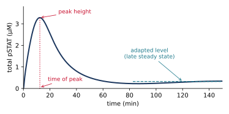

# Module 1 exercises: dynamics of the cytokine–STAT–SOCS model

**Name:** ________________________________________________

Use the models in the `models/` folder of the course repository. Run them in a
Jupyter notebook from the `notebooks/` folder, in VS Code, or in BNG Playground.
Concentrations are in µM and time is in minutes.

## A. Check the binding equilibrium

`stat_step1_binding.bngl` has `R0 = 1`, `kon = 1`, and `koff = 0.1`, so
K~D~ = `koff`/`kon` = 0.1 µM. At equilibrium,

[LR]~eq~ = ½ [ b − √(b² − 4 L~0~ R~0~) ],  where  b = L~0~ + R~0~ + K~D~

Simulate to t = 20 min so that binding reaches equilibrium (the model file's own
`simulate` action stops at t = 2 min, which is too early at low ligand).

| L~0~ (µM) | [LR]~eq~ from the formula | [LR] at the end of the simulation | Fraction of receptors bound |
|---:|---:|---:|---:|
| 0.1 | | | |
| 1 | | | |
| 10 | | | |

Above roughly what ligand concentration are almost all receptors bound?

________________________________________________________________________

## B. Tuning the pSTAT pulse

With SOCS feedback (`stat_step6_feedback.bngl`), total pSTAT rises to a peak
and then falls to a lower adapted level. We describe the pulse by three
properties:



<div class="pagebreak"></div>

The function below measures all three. The response oscillates slightly before
it settles, so it simulates to t = 600 min. The same code, ready to run, is in
`notebooks/pulse_exercise.ipynb`.

```python
import bngsim
import numpy as np

model = bngsim.Model.from_bngl("../models/stat_step6_feedback.bngl")
sim = bngsim.Simulator(model, method="ode")

def pulse(param=None, factor=1.0):
    """Time of peak, peak height, and adapted level of total pSTAT."""
    if param is not None:
        default = model.get_param(param)
        model.set_param(param, factor * default)
    model.reset()
    res = sim.run(t_span=(0, 600), n_points=6001)
    if param is not None:
        model.set_param(param, default)        # restore
    y = res.observables["pSTAT"]
    i = np.argmax(y)
    return res.time[i], y[i], y[-1]

print(pulse())              # default parameters
print(pulse("kact", 2))     # kact doubled
```

### B1. Predict before you simulate

For a **2× increase** in each parameter, predict the effect on each property.
Write ↑, ↓, or — (little or no change).

| Parameter | What it controls                       | Time of peak | Peak height | Adapted level |
|-----------|----------------------------------------|:------------:|:-----------:|:-------------:|
| `L0` | ligand concentration | | | |
| `kact` | STAT activation | | | |
| `kdiss` | pSTAT release from receptor | | | |
| `kdephos` | pSTAT dephosphorylation | | | |
| `ktl` | SOCS translation | | | |
| `kSOCSdeg` | SOCS degradation | | | |

<div class="pagebreak"></div>

### B2. Test your predictions

Record the values from `pulse(param, 2)`. Mark any change larger than 5% with
↑ or ↓ and circle the predictions you got wrong.

| Parameter doubled | Time of peak (min) | Peak height (µM) | Adapted level (µM) |
|---|---:|---:|---:|
| none (default) | | | |
| `L0` | | | |
| `kact` | | | |
| `kdiss` | | | |
| `kdephos` | | | |
| `ktl` | | | |
| `kSOCSdeg` | | | |

### B3. Explain

1. Which parameter changes the adapted level but not the time or height of the
   peak? Why can it affect the late response without affecting the early one?

   ______________________________________________________________________

   ______________________________________________________________________

2. Doubling `L0` has almost no effect. Use your answer to Part A to explain why.
   Now set `model.set_param("L0", 0.1)` and repeat `pulse()` and
   `pulse("L0", 2)`. Does ligand matter now? Why?

   ______________________________________________________________________

   ______________________________________________________________________

3. A drug should lower the adapted response while leaving the initial peak
   intact. Which of the parameters in your table would you target, and in which
   direction?

   ______________________________________________________________________

## C. Remove the phosphatase

In `stat_step4_release.bngl` (no SOCS yet), set `kdephos` to 0.

Before simulating, predict the value of total pSTAT after a long time:

________________________________________________________________________

After simulating: what sets this value, and why is there no longer a balance
between activation and deactivation?

________________________________________________________________________

<div class="pagebreak"></div>

## D. Toward Module 2

In our model, SOCS can bind only the empty ligand-bound receptor LR. Suppose
SOCS can also bind receptors that carry unphosphorylated STAT (LRS).

Write the new reaction in the notation of Module 1, and name the new species.

________________________________________________________________________

What other reactions does the new complex need (for example, can STAT still
unbind from it, or be activated)? List them.

________________________________________________________________________

________________________________________________________________________

## Exit response

1. In one sentence: why does negative feedback produce a peak instead of a
   steady rise to a plateau?

   ______________________________________________________________________

2. Which steps in the model create the delay before the feedback takes effect?

   ______________________________________________________________________
